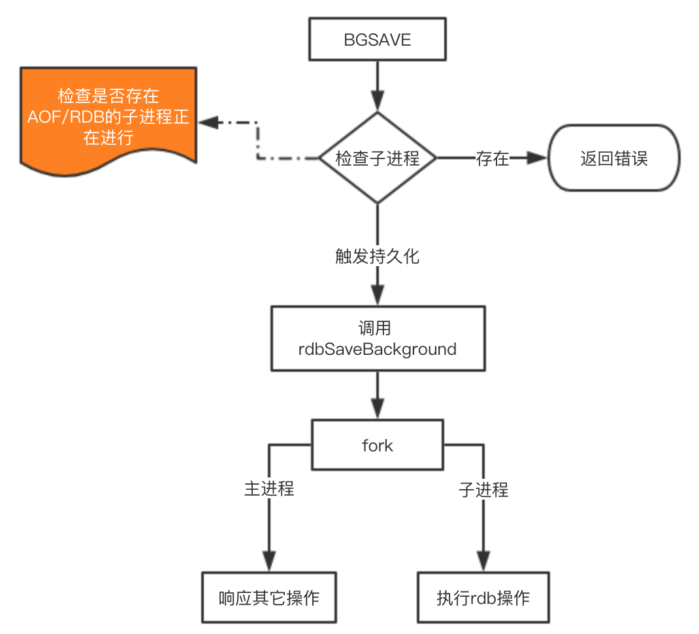

<font size="4">

# Redis持久化的原理及优化

Redis为持久化提供了两种方式：

1. RDB：在指定的时间间隔能对你的数据进行快照存储。
1. AOF：记录每次对服务器写的操作,当服务器重启的时候会重新执行这些命令来恢复原始的数据。

## RDB的持久化配置
```sh
# 时间策略
save 900 1 # 表示900s内如果有1条是写入命令，就触发产生一次快照，可以理解为就进行一次备份
save 300 10
save 60 10000
save "" # 禁用RDB
# 文件名称
dbfilename dump.rdb

# 文件保存路径
dir /home/work/app/redis/data/

# 如果持久化出错，主进程是否停止写入
stop-writes-on-bgsave-error yes

# 是否压缩
rdbcompression yes

# 导入时是否检查
rdbchecksum yes
```

## AOF配置
```sh
# 是否开启aof
appendonly yes

# 文件名称
appendfilename "appendonly.aof"

# 同步方式
appendfsync everysec #always everysec no

# aof重写期间是否同步
no-appendfsync-on-rewrite no

# 重写触发配置
auto-aof-rewrite-percentage 100
auto-aof-rewrite-min-size 64mb

# 加载aof时如果有错如何处理
aof-load-truncated yes

# 文件重写策略
aof-rewrite-incremental-fsync yes
```
appendfsync everysec 它其实有三种模式:
1. always 每一条命令都同步
1. everysec 每秒同步一次
1. no redis不处理交给OS来处理，非常快，但是也最不安全

## RDB的原理
在Redis中RDB持久化的触发分为两种：自己手动触发与Redis定时触发。
##  手动触发方式
1. save:会阻塞当前Redis服务器，直到持久化完成，线上应该禁止使用。
2. bgsave该触发方式会fork一个子进程，由子进程负责持久化过程，因此阻塞只会发生在fork子进程的时候。
## 自动触场景
1. 根据我们的 save m n 配置规则自动触发；
1. 从节点全量复制时，主节点发送rdb文件给从节点完成复制操作，主节点会触发 bgsave；
1. 执行 debug reload 时；
1. 执行 shutdown时，如果没有开启aof，也会触发。

### bgsave如何完成持久化

fork操作会造成redis读写性能下降可以控制单个Redis实例的最大内存，来尽可能降低Redis在fork时的事件消耗。以及上面提到的自动触发的频率减少fork次数，或者使用手动触发，根据自己的机制来完成持久化。

## AOF原理
1. 所有的写命令会追加到 AOF 缓冲中。
1. AOF 缓冲区根据对应的策略向硬盘进行同步操作。
1. 随着 AOF 文件越来越大，需要定期对 AOF 文件进行重写，达到压缩的目的。
1. 当 Redis 重启时，可以加载 AOF 文件进行数据恢复。

