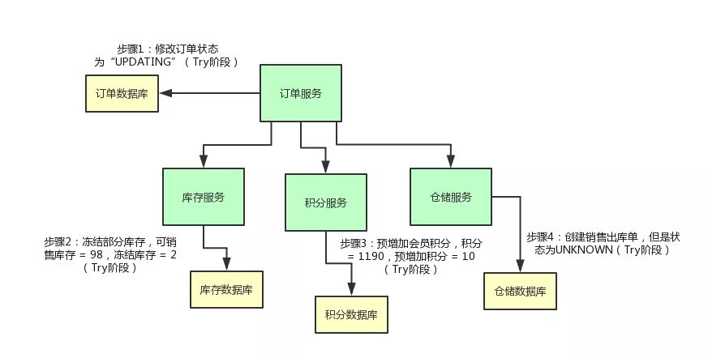

# 分布式事务解决方案

# 2pc两阶段提交
这里所说的中心化是指协议中有两类节点：一个是中心化协调者节点和N个参与者节点
两个阶段：第一阶段：投票阶段 和第二阶段：提交/执行阶段。
### 第一阶段:投票阶段
第一阶段分三步:
1. 事务查询:
    - 协调者 向所有的 参与者 发送事务预处理请求，称之为Prepare，并开始等待各 参与者 的响应
2. 执行本地事务(不commit):
    - 各个 参与者 节点执行本地事务操作,但在执行完成后并不会真正提交数据库本地事务，而是先向 协调者 报告说：“我这边可以处理了/我这边不能处理”。.
3. 参与者与协调者反馈:
    - 如果 参与者 成功执行了事务操作,那么就反馈给协调者 Yes 响应,表示事务可以执行,如果没有 参与者 成功执行事务,那么就反馈给协调者 No 响应,表示事务不可以执行。
第一阶段执行完后，会有两种可能。1、所有都返回Yes. 2、有一个或者多个返回No。

### 第二阶段：提交/执行阶段（成功流程）
第二阶段主要分为两步
1. 所有的参与者反馈给协调者的信息都是Yes,那么就会执行事务提交
    - 协调者 向 所有参与者 节点发出Commit请求.
2. 事务提交
    - 参与者 收到Commit请求之后,就会正式执行本地事务Commit操作,并在完成提交之后释放整个事务执行期间占用的事务资源。

### 第二阶段：提交/执行阶段（异常流程）
异常流程第二阶段也分为两步
1. 发送回滚请求
    - 协调者 向所有参与者节点发出 RoollBack 请求.
2. 事务回滚
    - 参与者 接收到RoollBack请求后,会回滚本地事务。

## 2pc的缺点
1. 性能问题
- 无论哪个阶段所有的参与者资源和协调者资源都是被锁住的,只有当所有节点准备完毕，事务 协调者 才会通知进行全局提交，参与者 进行本地事务提交后才会释放资源。这样的过程会比较漫长，对性能影响比较大。
2. 单节点故障
- 协调者 发生故障。参与者 会一直阻塞下去。尤其在第二阶段，协调者 发生故障，那么所有的 参与者 还都处于
锁定事务资源的状态中，而无法继续完成事务操作。

# TCC分布式事务
## 1. 阶段一:Try阶段
- 如果你要实现一个 TCC 分布式事务，首先你的业务的主流程以及各个接口提供的业务含义，不是说直接完成那个业务操作，而是完成一个 Try 的操作。
这个操作，一般都是锁定某个资源，设置一个预备类的状态，冻结部分数据，等等，大概都是这类操作。

## 2. 阶段二:Confirm
- 然后就分成两种情况了，第一种情况是比较理想的，那就是各个服务执行自己的那个 Try 操作，都执行成功了此时，TCC 分布式事务框架会控制进入 TCC 下一个阶段，第一个 C 阶段，也就是 Confirm 阶段。此时把预处理的字段算到数据库实际的字段中
- 一旦订单服务里面的 TCC 分布式事务框架感知到各个服务的 Try 阶段都成功了以后，就会执行各个服务的 Confirm 逻辑。

## 3. 阶段三:Cancel
如果在 Try 阶段，比如积分服务吧，它执行出错了，此时会怎么样？

那订单服务内的 TCC 事务框架是可以感知到的，然后它会决定对整个 TCC 分布式事务进行回滚。TCC框架会调用cancel的接口把预处理的字段还回数据库实际字段

## TCC的优缺点
## -优点:
1. 解决了跨服务的业务操作原子性问题，例如组合支付，订单减库存等场景非常实用
1. TCC的本质原理是把数据库的二阶段提交上升到微服务来实现，从而避免了数据库2阶段中锁冲突的长事务低性能风险。
1. TCC异步高性能，它采用了try先检查，然后异步实现confirm，真正提交的是在confirm方法中。
## -缺点:
1. 对微服务的侵入性强，微服务的每个事务都必须实现try，confirm，cancel等3个方法，开发成本高，今后维护改造的成本也高。
1. 为了达到事务的一致性要求，try，confirm、cancel接口必须实现等幂性操作。（定时器+重试）
1. 由于事务管理器要记录事务日志，必定会损耗一定的性能，并使得整个TCC事务时间拉长，建议采用redis的方式来记录事务日志。
1. tcc需要通过锁来确保数据的一致性，会加锁导致性能不高